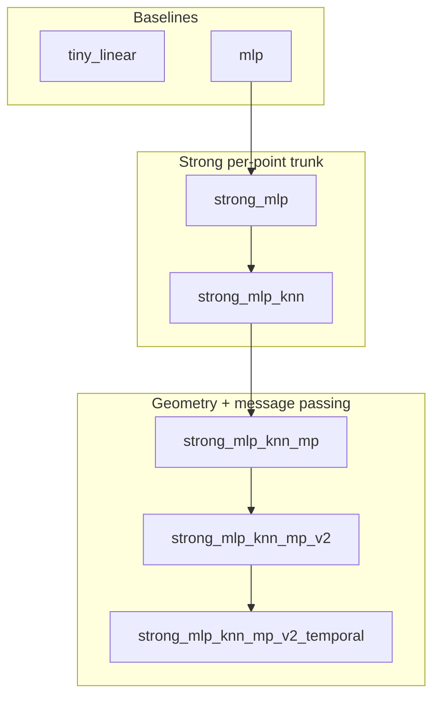

# Model lineage (quick reference)

One-page view of **registered** models (`models/registry.py`): what each adds, and **why** that step was taken. All share the same competition `forward(t, pos, idcs_airfoil, velocity_in)` contract.

## Family diagram

## Registry overview

| Registry key | Implementation | Role |
|--------------|----------------|------|
| `tiny_linear` | [`models/tiny_linear/`](../models/tiny_linear/) | Minimal sanity / tests |
| `mlp` | [`models/mlp/`](../models/mlp/) | Organizer-style reference MLP |
| `strong_mlp` | [`models/strong_mlp/`](../models/strong_mlp/) | Deeper/wider **point-wise** MLP + surface mask |
| `strong_mlp_knn` | [`models/strong_mlp_knn/`](../models/strong_mlp_knn/) | **Local neighborhood**: kNN once, neighbor attention + per-τ neighbor means |
| `strong_mlp_knn_mp` | [`models/strong_mlp_knn_mp/`](../models/strong_mlp_knn_mp/) | kNN + **distance-to-airfoil** + **one** residual message-passing block |
| `strong_mlp_knn_mp_v2` | [`models/strong_mlp_knn_mp_v2/`](../models/strong_mlp_knn_mp_v2/) | **Two** MP blocks, **attention-weighted** neighbor messages, **richer edges** |
| `strong_mlp_knn_mp_v2_temporal` | [`models/strong_mlp_knn_mp_v2_temporal/`](../models/strong_mlp_knn_mp_v2_temporal/) | Same as v2 + **residual temporal Conv1d** on `velocity_in` before kNN/MP |

Example configs: `configs/example_mlp.yaml`, `configs/strong_baseline*.yaml`, `configs/strong_baseline_knn_mp.yaml`, `configs/strong_baseline_knn_mp_v2.yaml`, `configs/strong_baseline_knn_mp_v2_temporal.yaml`.

---

## Why each iteration

### `strong_mlp` (vs `mlp`)

**Design:** Each point gets an MLP on `[position, flattened input velocities, time encodings, surface indicator]` — no explicit interaction between points.

**Why:** Stronger capacity and normalization for streaming training, while staying simple and fast. Good baseline before adding geometry-heavy structure.

### `strong_mlp_knn` (vs `strong_mlp`)

**Design:** One **brute-force kNN** graph on positions. Each point attends over neighbors using neighbor **velocity + relative offset**, and receives **per-input-timestep** statistics of neighbor velocities. Trunk is still an MLP on a fixed-size feature vector per point.

**Why:** Flow fields are **spatially local**; points should “see” nearby fluid state, not only their own coordinates. kNN + pooling/attention is a lightweight way to inject locality without a full mesh solver.

### `strong_mlp_knn_mp` (vs `strong_mlp_knn`)

**Design:** Keep kNN + neighbor attention + per-τ neighbor features, and add:

- **Geometry:** per-point distance to the airfoil surface (and `log1p`), so the model can separate near-wall / wake context from bulk points.
- **One residual MP step:** embed raw features, message neighbors via an **edge MLP**, **mean**-aggregate, node update + LayerNorm, then **merge** `raw ‖ h_mp` before the global MLP trunk.

**Why:** A single message pass propagates information one graph hop beyond the fixed attention vector; surface distance stresses **problem-specific geometry** (competition is airfoil-centric).

### `strong_mlp_knn_mp_v2` (vs `strong_mlp_knn_mp`)

**Design:** Same story as v1, plus deliberate structural upgrades:

1. **Two** stacked residual MP blocks (second operates on hidden node states `h1`, not another copy of raw embed only).
2. **Attention-weighted** aggregation of edge messages (same neighbor softmax used for the attention pooled feature).
3. **Richer edges:** neighbor **relative mean-velocity** and **inverse distance** `1/(ε + ‖Δx‖)` alongside `h_i, h_j, Δx`.

**Merge** widened to **Option A:** `concat(x_raw, h1, h2)` so the trunk sees both MP stages.

**Why:** Empirical runs showed error dominated by **high-fluctuation (“turbulent proxy”)** regions and slightly worse **late output timesteps**. Deeper local mixing, learned neighbor importance on messages, and velocity-geometry edges target those failure modes without changing the I/O contract. **v1 is left untouched** so older checkpoints and comparisons stay valid.

### `strong_mlp_knn_mp_v2_temporal` (vs `strong_mlp_knn_mp_v2`)

**Design:** **Subclass** of v2. Per point, apply a small **Conv1d** stack along the input time axis to produce a residual added to `velocity_in`; then run the unchanged v2 forward on the mixed series (kNN, MP, trunk).

**Why:** Gives an explicit **temporal** mixing step before spatial message passing, targeting **multi-step input dynamics** and late-`T_out` error without a third MP block.

---

## Data flow (shared skeleton)

For kNN models, each batch item (often `batch_size = 1`) does roughly:

1. Build `k`-NN on point cloud; optional **train/val point subsampling** is done **before** forward (see [`training/hf_dataset.py`](../training/hf_dataset.py)).
2. Build per-point feature vector(s); run MP block(s) if present.
3. Shared **MLP trunk** + **one linear head per output timestep** → `(B, 5, N, 3)`.

---

## See also

- [ADDING_A_MODEL.md](ADDING_A_MODEL.md) — how to add another entry
- [CODEBASE_OVERVIEW.md](CODEBASE_OVERVIEW.md) — training loop and HF data path
